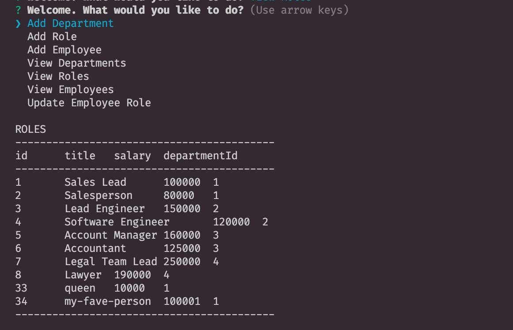

# Unit 12 MySQL Homework: Employee Tracker

Developers are often tasked with creating interfaces that make it easy for non-developers to view and interact with information stored in databases. Often these interfaces are known as **C**ontent **M**anagement **S**ystems. In this homework assignment, our challenge was to architect and build a solution for managing a company's employees using node, inquirer, and MySQL.

This app is a command-line application that at a minimum allows the user to:

  * Add departments, roles, employees

  * View departments, roles, employees

  * Update employee roles

[Check out my video here!](https://drive.google.com/file/d/1_0g32Bx7UICdOvyPMdJiTemDE8j7iFCu/view?usp=sharing)

<